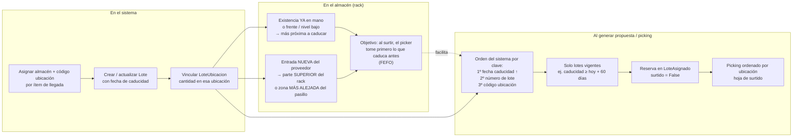
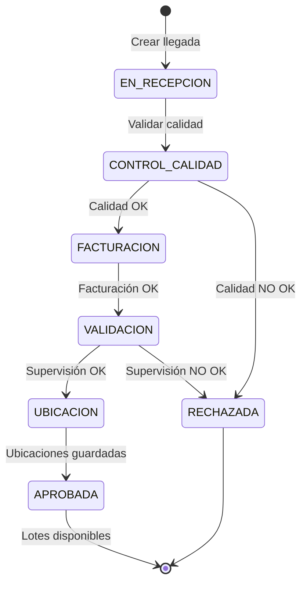

# Flujo de entrada a suministro — Sistema de Inventario Hospitalario

**Versión:** 1.0  
**Alcance:** Cita de proveedor → Recepción → Ubicación → Pedido → Propuesta → Picking → Surtido  
**Referencias:** `MANUAL_CITAS_PROVEEDORES.md`, `MANUAL_LLEGADA_PROVEEDORES.md`, `MANUAL_PEDIDOS.md`

---

## Tabla de contenidos

1. [Resumen ejecutivo](#resumen-ejecutivo)
2. [Diagrama general](#diagrama-general)
3. [Ubicación física y regla FEFO](#ubicación-física-y-regla-fefo)
4. [Estados por etapa](#estados-por-etapa)
5. [Secuencia operativa](#secuencia-operativa)
6. [Roles](#roles)
7. [Módulos y rutas](#módulos-y-rutas)
8. [Documento de capacitación](#documento-de-capacitación)

---

## Resumen ejecutivo

El flujo completo consta de **seis bloques**:

| # | Bloque | Resultado en sistema |
|---|--------|----------------------|
| 1 | Cita de proveedor | Cita **AUTORIZADA** (requisito para recibir) |
| 2 | Llegada y validaciones | Llegada **APROBADA**, lotes creados |
| 3 | Inventario | `Lote` + `LoteUbicacion` + movimiento **ENTRADA** |
| 4 | Pedido | Solicitud **VALIDADA** |
| 5 | Propuesta | Propuesta **GENERADA** → **REVISADA** (reservas) |
| 6 | Surtimiento | Picking → **SURTIDA** + movimientos **SALIDA** |

La **ubicación física en rack** debe alinearse con la regla **FEFO** (First Expired, First Out) que usa el generador de propuestas: primero caducidad, luego lote, luego ubicación.

---

## Diagrama general

```mermaid
flowchart TB
    subgraph CITAS["1. Programación de cita"]
        A1[Crear cita con proveedor<br/>fecha, hora, almacén]
        A2{Autorizar cita}
        A1 --> A2
        A2 -->|No| A1
        A2 -->|Sí| A3["Estado: AUTORIZADA<br/>✓ Puede registrarse llegada"]
    end

    subgraph LLEGADA["2. Recepción y aprobación de entrada"]
        B1[Registrar llegada<br/>vinculada a cita autorizada]
        B2[Capturar recepción<br/>remisión, piezas, ítems, lote, caducidad]
        B3[Control de calidad]
        B4[Facturación]
        B5[Supervisión]
        B6[Asignar ubicación en sistema<br/>+ colocación física en rack]
        B7["Estado llegada: APROBADA<br/>→ Crea Lote + LoteUbicacion<br/>→ Movimiento ENTRADA"]
        B1 --> B2 --> B3 --> B4 --> B5 --> B6 --> B7
    end

    subgraph INVENTARIO["3. Inventario disponible"]
        C1["Lotes en ubicaciones<br/>cantidad_disponible actualizada"]
    end

    subgraph PEDIDO["4. Pedido institucional"]
        D1[Crear solicitud de pedido<br/>ítems + cantidades]
        D2[Validar solicitud<br/>aprobar cantidades]
        D3["Estado: VALIDADA"]
        D1 --> D2 --> D3
    end

    subgraph PROPUESTA["5. Propuesta de suministro / pickeo"]
        E1["Generar propuesta automática<br/>Estado: GENERADA"]
        E2[Editar propuesta opcional<br/>lotes, ubicaciones, cantidades]
        E3[Revisar / aprobar propuesta<br/>almacén]
        E4["Estado: REVISADA<br/>Reservas activas LoteAsignado"]
        D3 --> E1 --> E2 --> E3 --> E4
    end

    subgraph SURTIMIENTO["6. Picking y surtido"]
        F1[Picking / hoja de surtido<br/>recorrido por ubicación]
        F2[Recoger físicamente<br/>según propuesta FEFO]
        F3[Surtir propuesta<br/>confirmar]
        F4["Estado: SURTIDA<br/>Movimientos SALIDA<br/>Reservas liberadas"]
        E4 --> F1 --> F2 --> F3 --> F4
    end

    A3 --> B1
    B7 --> C1
    C1 --> D1
    C1 --> E1
```



---

## Ubicación física y regla FEFO

### Diagrama: sistema vs almacén físico



### Regla práctica de colocación

| Tipo de mercancía | Dónde colocar físicamente | Por qué |
|-------------------|---------------------------|---------|
| **Existencia anterior** (ya en almacén, caducidad más cercana) | **A la mano**, frente, nivel bajo o zona de picking | Es la que el sistema priorizará al surtir (FEFO) |
| **Entrada reciente** (llegada del día) | **Parte superior del rack** o **más alejada** del pasillo | No se mezcla con lo que debe salir primero |
| **Surtimiento** | Seguir la **propuesta / hoja de picking** | El generador ordena por caducidad → lote → ubicación |

> **Importante:** El sistema no mueve el producto solo. La propuesta es correcta si la **ubicación registrada en BD** coincide con **dónde quedó físicamente** el producto.

### Algoritmo de propuesta (referencia técnica)

Implementado en `inventario/propuesta_generator.py`:

1. Filtrar lotes del producto con estado Disponible y caducidad mínima (p. ej. ≥ 60 días).
2. Ordenar por `fecha_caducidad`, `numero_lote`, código de ubicación.
3. Descontar reservas activas (`LoteAsignado` con `surtido=False`).
4. Asignar cantidades y crear reservas hasta cubrir lo aprobado en la solicitud.

---

## Estados por etapa

### Citas de proveedor

| Estado | Descripción | ¿Registrar llegada? |
|--------|-------------|---------------------|
| PROGRAMADA | Creada, pendiente de autorizar | No |
| **AUTORIZADA** | Aprobada para recepción | **Sí** |
| COMPLETADA | Llegada registrada | No |
| CANCELADA | Cancelada | No |

```
PROGRAMADA → AUTORIZADA → COMPLETADA
             (obligatorio)
```

### Llegada de proveedor

| Estado | Paso |
|--------|------|
| EN_RECEPCION | Recepción e ítems |
| CONTROL_CALIDAD | Inspección |
| FACTURACION | Datos de factura |
| VALIDACION | Supervisión |
| UBICACION | Asignación almacén + ubicación |
| **APROBADA** | Lotes en inventario |
| RECHAZADA / CANCELADA | Fin del flujo |



### Pedido y propuesta

| Etapa | Estado solicitud | Estado propuesta |
|-------|------------------|------------------|
| Creada | PENDIENTE | — |
| Validada | **VALIDADA** | **GENERADA** |
| Editada (opc.) | VALIDADA | GENERADA |
| Revisada por almacén | VALIDADA | **REVISADA** |
| Picking | VALIDADA / EN_PREPARACION | REVISADA / EN_SURTIMIENTO |
| Cerrada | ENTREGADA (según flujo) | **SURTIDA** |

```
Crear solicitud → PENDIENTE
Validar → VALIDADA + Propuesta GENERADA
[Editar propuesta] → GENERADA
Revisar propuesta → REVISADA
Picking → recolección física
Surtir → SURTIDA + movimientos SALIDA
```

---

## Secuencia operativa

```
1. CITA          Crear → Autorizar (AUTORIZADA)
2. LLEGADA       Registrar con cita → Recepción → Calidad → Facturación → Supervisión
3. UBICACIÓN     Sistema: almacén + ubicación por ítem
                 Físico: existencia vieja al frente/abajo · entrada nueva arriba/atrás
4. INVENTARIO    Lote disponible + movimiento ENTRADA
5. PEDIDO        Solicitud → Validar cantidades (VALIDADA)
6. PROPUESTA     Generar (GENERADA) → [Editar] → Revisar/Aprobar (REVISADA)
7. PICKING       Hoja por ubicación → recoger en rack (FEFO)
8. SURTIR        Confirmar → SALIDA → SURTIDA
```

---

## Roles

| Fase | Rol típico |
|------|------------|
| Cita | Comprador / planificador |
| Autorización de cita | Jefe de almacén |
| Recepción | Almacenero |
| Control de calidad | Inspector de calidad |
| Facturación | Contador / facturación |
| Supervisión | Supervisor |
| Ubicación (sistema + físico) | Encargado de almacén + personal de rack |
| Solicitud de pedido | Institución / área solicitante |
| Validación de pedido | Supervisor de pedidos / almacén |
| Propuesta, picking, surtido | Almacenero / picker |

---

## Módulos y rutas

| Paso | Menú / módulo | Notas |
|------|---------------|-------|
| Cita | Logística → Citas de proveedores | Requisito: AUTORIZADA |
| Llegada | Logística → Llegada de proveedores | Vinculada a cita |
| Lotes / inventario | Gestión de inventario → Lotes | Tras llegada APROBADA |
| Pedido | Logística → Gestión de pedidos | Folio SOL-… |
| Propuesta | Logística → Propuestas | Desde pedido validado |
| Picking / surtir | Detalle de propuesta | REVISADA → SURTIDA |
| Kardex / movimientos | Reportes / Movimientos | Trazabilidad post-surtido |

Prefijos de URL según instalación (ej. `/logistica/`, `/gestion-inventario/`).

---

## Documento de capacitación

Versión de **una página para imprimir** (roles con iconos y checklist):

→ **[GUIA_RAPIDA_ALMACEN_ENTRADA_SUMINISTRO.md](./GUIA_RAPIDA_ALMACEN_ENTRADA_SUMINISTRO.md)**

---

## Historial de cambios

| Fecha | Cambio |
|-------|--------|
| 2026-05 | Versión inicial: diagramas Mermaid + FEFO + referencia a manuales |
