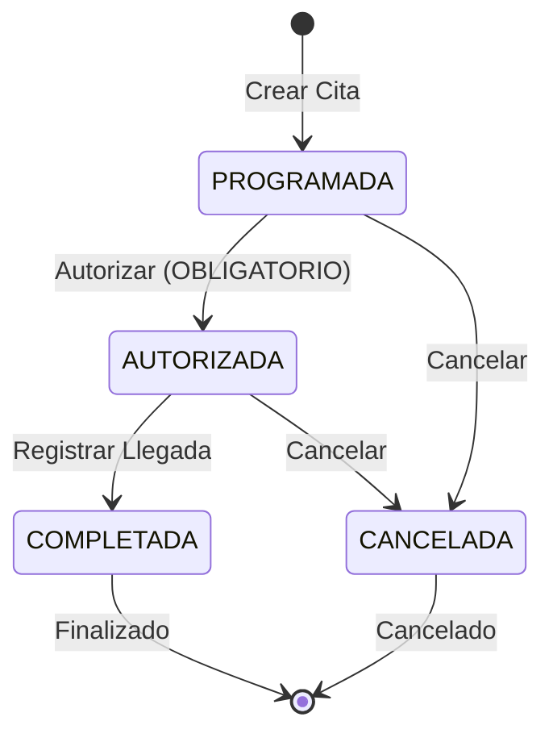
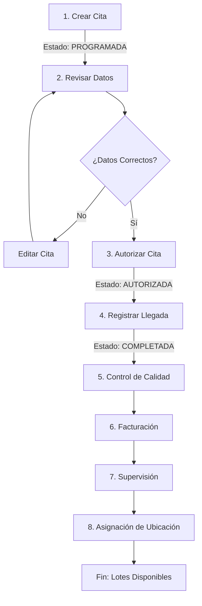

# Manual: Fase 2.2.1 - Citas de Proveedores

**Versión:** 1.0  
**Fecha:** Diciembre 2025  
**Estado:** Completado

---

## Tabla de Contenidos

1. [Introducción](#introducción)
2. [Conceptos Clave](#conceptos-clave)
3. [Manual de Usuario](#manual-de-usuario)
4. [Documentación Técnica](#documentación-técnica)
5. [Diagramas de Flujo](#diagramas-de-flujo)
6. [Casos de Uso](#casos-de-uso)
7. [Integración con Llegadas](#integración-con-llegadas)
8. [Preguntas Frecuentes](#preguntas-frecuentes)

---

## Introducción

### Descripción General

La **Fase 2.2.1: Citas de Proveedores** es el módulo encargado de gestionar y programar las citas de entrega de mercancía con los proveedores. Este módulo es **fundamental y prerequisito** para poder registrar llegadas de proveedores en el sistema.

### ⚠️ Importancia Crítica

> **REQUISITO OBLIGATORIO:** Una cita debe estar **generada y aprobada (AUTORIZADA)** antes de poder registrar una llegada de proveedor. Sin una cita autorizada, no es posible proceder con el flujo de recepción.

### Objetivos

- Programar citas de entrega con proveedores
- Autorizar citas para recepción
- Validar disponibilidad de almacén
- Registrar información de contacto
- Generar trazabilidad de citas
- Permitir solo llegadas de citas autorizadas

### Roles Involucrados

| Rol | Responsabilidad |
|-----|-----------------|
| **Comprador/Planificador** | Crea citas de proveedores |
| **Jefe de Almacén** | Autoriza citas |
| **Almacenero** | Registra llegadas de citas autorizadas |
| **Supervisor** | Valida cumplimiento de citas |

---

## Conceptos Clave

### Estados de una Cita

Una cita progresa a través de los siguientes estados:

| Estado | Descripción | Acciones Disponibles | Puede Registrar Llegada |
|--------|-------------|---------------------|------------------------|
| **PROGRAMADA** | Cita creada pero no autorizada | Editar, Autorizar, Cancelar | ❌ **NO** |
| **AUTORIZADA** | Cita aprobada para recepción | Registrar Llegada, Cancelar | ✅ **SÍ** |
| **COMPLETADA** | Llegada registrada | Ver Detalle | ❌ No |
| **CANCELADA** | Cita cancelada | Ver Detalle | ❌ No |

### Flujo Obligatorio

```
PROGRAMADA → AUTORIZADA → COMPLETADA
             (OBLIGATORIO)  (Automático)
```

**Nota:** Una cita AUTORIZADA es requisito indispensable para registrar una llegada.

---

## Manual de Usuario

### 1. Acceso al Módulo

#### Paso 1: Navegar al Módulo
1. Inicia sesión en el sistema
2. Dirígete a **Logística** → **Citas de Proveedores**
3. Verás el dashboard con resumen de citas

#### Paso 2: Dashboard Principal

El dashboard muestra:
- **Tarjetas de resumen** con conteos por estado:
  - Programadas
  - Autorizadas
  - Completadas
  - Canceladas
- **Tabla de citas** con columnas:
  - Proveedor
  - Fecha y Hora
  - Almacén
  - Estado
  - Acciones

---

### 2. Crear Nueva Cita

#### Paso 1: Iniciar Creación
1. Haz clic en el botón **"+ Nueva Cita"** (color morado)
2. Se abrirá el formulario de creación

#### Paso 2: Seleccionar Proveedor

```
Campo: Proveedor
- Haz clic en el dropdown (Select2)
- Busca por razón social o RFC
- Selecciona el proveedor
```

**Ejemplo:**
```
Buscar: "AMBIDERM"
Resultado: AMBIDERM, S.A. DE C.V. (AMB890104563)
```

**Nota:** El proveedor debe estar registrado en el catálogo de proveedores.

#### Paso 3: Seleccionar Almacén

```
Campo: Almacén
- Haz clic en el dropdown
- Selecciona el almacén de destino
- Solo aparecen almacenes activos
```

**Ejemplo:**
```
Almacén: Almacén ALMACÉN CENTRAL
```

#### Paso 4: Programar Fecha y Hora

| Campo | Descripción | Formato |
|-------|-------------|---------|
| **Fecha de Cita** | Fecha de entrega programada | DD/MM/YYYY |
| **Hora de Cita** | Hora de llegada programada | HH:MM |

**Ejemplo:**
```
Fecha: 28/12/2025
Hora: 08:00
```

**Validaciones:**
- La fecha debe ser futura (no puede ser hoy o pasada)
- La hora debe ser en formato 24 horas
- Se recomienda agendar con anticipación

#### Paso 5: Datos de Contacto (Opcional)

| Campo | Descripción |
|-------|-------------|
| **Persona de Contacto** | Nombre de quien entrega |
| **Teléfono de Contacto** | Teléfono del proveedor |
| **Observaciones** | Notas adicionales |

**Ejemplo:**
```
Persona de Contacto: Juan Pérez
Teléfono: (555) 123-4567
Observaciones: Entrega con factura, requiere firma
```

#### Paso 6: Guardar Cita

1. Revisa que todos los datos obligatorios estén completos
2. Haz clic en **"Guardar Cita"**
3. La cita se creará con estado **PROGRAMADA**

**Resultado:**
- Se genera un ID único para la cita
- El estado es PROGRAMADA
- Aparece en el dashboard
- **AÚN NO está lista para registrar llegada**

---

### 3. Autorizar Cita (PASO CRÍTICO)

#### ⚠️ ESTE PASO ES OBLIGATORIO

**La autorización es OBLIGATORIA para poder registrar una llegada. Sin autorización, no se puede proceder.**

#### Paso 1: Acceder a Cita

1. En el dashboard, localiza la cita con estado **PROGRAMADA**
2. Haz clic en el botón de **acciones** (ojo)
3. Se abrirá el detalle de la cita

#### Paso 2: Revisar Información

Verifica que los datos sean correctos:
- ✓ Proveedor correcto
- ✓ Almacén disponible
- ✓ Fecha y hora apropiadas
- ✓ Datos de contacto completos

#### Paso 3: Autorizar Cita

1. Haz clic en el botón **"Autorizar Cita"** (color verde)
2. Se abrirá un diálogo de confirmación
3. Confirma la autorización

**Validaciones del Sistema:**
- El almacén debe estar disponible
- La fecha debe ser válida
- El proveedor debe estar activo

#### Paso 4: Confirmación

1. El estado cambiará a **AUTORIZADA**
2. Aparecerá un mensaje de éxito
3. **Ahora la cita está lista para registrar una llegada**

**Resultado:**
- Estado: **AUTORIZADA**
- ✅ Disponible para registrar llegada
- Visible en el filtro "Autorizadas"
- Puede proceder con Llegada de Proveedores

---

### 4. Registrar Llegada desde Cita Autorizada

#### Paso 1: Acceder a Cita Autorizada

1. En el dashboard, localiza una cita con estado **AUTORIZADA**
2. Haz clic en el botón de **acciones** (ojo)

#### Paso 2: Registrar Llegada

1. Haz clic en el botón **"Registrar Llegada"**
2. Se redirigirá al módulo de Llegada de Proveedores
3. La cita estará preseleccionada en el formulario

**Nota:** Este es el flujo recomendado. También puedes ir directamente a Llegadas y seleccionar la cita desde ahí.

#### Paso 3: Completar Llegada

1. Captura datos de recepción
2. Agrega items
3. Guarda la llegada

**Resultado:**
- Se crea la llegada
- El estado de la cita cambia automáticamente a **COMPLETADA**
- La cita ya no aparece en "Autorizadas"
- Continúa con Control de Calidad

---

### 5. Cancelar Cita

#### Paso 1: Acceder a Cita

1. Localiza la cita que deseas cancelar
2. Haz clic en el botón de **acciones**

#### Paso 2: Cancelar

1. Haz clic en el botón **"Cancelar Cita"** (color rojo)
2. Se abrirá un diálogo de confirmación

#### Paso 3: Confirmar Cancelación

1. Ingresa el motivo de cancelación (opcional)
2. Haz clic en **"Confirmar Cancelación"**

**Validaciones:**
- No se puede cancelar una cita con llegada registrada
- Se puede cancelar citas PROGRAMADAS y AUTORIZADAS

**Resultado:**
- Estado: CANCELADA
- No se puede registrar llegada
- Aparece en el filtro "Canceladas"

---

### 6. Editar Cita

#### Paso 1: Acceder a Cita

1. Localiza la cita a editar
2. Haz clic en el botón de **acciones**

#### Paso 2: Editar

1. Haz clic en el botón **"Editar"** (si está disponible)
2. Se abrirá el formulario de edición

#### Paso 3: Modificar Datos

Puedes editar:
- Fecha y hora
- Almacén
- Datos de contacto
- Observaciones

**Restricciones:**
- No se puede editar si la cita está COMPLETADA o CANCELADA
- No se puede cambiar el proveedor

#### Paso 4: Guardar Cambios

1. Revisa los cambios
2. Haz clic en **"Guardar Cambios"**

---

## Documentación Técnica

### Arquitectura

#### Componentes Principales

```
CitaProveedor (Modelo Principal)
├── Proveedor (Relación ForeignKey)
├── Almacen (Relación ForeignKey)
├── LlegadaProveedor (Relación OneToOne, opcional)
└── HistorialCita (Relación OneToMany)
```

### Modelos de Datos

#### CitaProveedor

```python
class CitaProveedor(models.Model):
    ESTADO_CHOICES = [
        ('programada', 'Programada'),
        ('autorizada', 'Autorizada'),
        ('completada', 'Completada'),
        ('cancelada', 'Cancelada'),
    ]
    
    # Identificadores
    id = UUIDField(primary_key=True, default=uuid4)
    
    # Relaciones
    proveedor = ForeignKey('Proveedor', on_delete=models.PROTECT)
    almacen = ForeignKey('Almacen', on_delete=models.PROTECT)
    
    # Datos de Cita
    fecha_cita = DateField()
    hora_cita = TimeField()
    persona_contacto = CharField(max_length=100, blank=True)
    telefono_contacto = CharField(max_length=20, blank=True)
    observaciones = TextField(blank=True)
    
    # Estado
    estado = CharField(
        max_length=20,
        choices=ESTADO_CHOICES,
        default='programada'
    )
    
    # Auditoría
    creado_por = ForeignKey(User, related_name='citas_creadas')
    autorizado_por = ForeignKey(User, null=True, blank=True, related_name='citas_autorizadas')
    fecha_creacion = DateTimeField(auto_now_add=True)
    fecha_autorizacion = DateTimeField(null=True, blank=True)
    fecha_actualizacion = DateTimeField(auto_now=True)
```

---

## Diagramas de Flujo

### Ciclo de Vida de una Cita



### Flujo Recomendado



---

## Casos de Uso

### Caso 1: Crear y Autorizar Cita Exitosamente

**Escenario:** Un comprador programa una cita con un proveedor y la autoriza.

**Pasos:**

1. **Comprador** crea cita:
   - Proveedor: "AMBIDERM, S.A. DE C.V."
   - Almacén: "Almacén ALMACÉN CENTRAL"
   - Fecha: 28/12/2025
   - Hora: 08:00
   - Contacto: Juan Pérez
   - Teléfono: (555) 123-4567

2. **Cita se crea** con estado PROGRAMADA

3. **Jefe de Almacén** revisa:
   - Verifica disponibilidad de almacén
   - Confirma que el proveedor es activo
   - Valida la fecha y hora

4. **Jefe de Almacén** autoriza:
   - Haz clic en "Autorizar Cita"
   - Confirma autorización

5. **Resultado:**
   - Estado: AUTORIZADA
   - Visible en "Citas Autorizadas"
   - ✅ Lista para registrar llegada

---

### Caso 2: Flujo Completo Cita-Llegada

**Escenario:** Flujo completo desde cita hasta llegada.

**Pasos:**

1. **Comprador** crea cita (como en Caso 1)

2. **Jefe de Almacén** autoriza cita

3. **Almacenero** registra llegada:
   - Accede a Citas de Proveedores
   - Localiza cita AUTORIZADA
   - Haz clic en "Registrar Llegada"
   - Se abre formulario de Llegada con cita preseleccionada

4. **Almacenero** completa llegada:
   - Captura datos de recepción
   - Agrega items
   - Guarda llegada

5. **Resultado:**
   - Cita cambia a COMPLETADA
   - Llegada creada con estado EN_RECEPCION
   - Flujo continúa con Control de Calidad

---

### Caso 3: Cancelar Cita Programada

**Escenario:** Se necesita cancelar una cita antes de ser autorizada.

**Pasos:**

1. **Comprador** crea cita

2. **Comprador** decide cancelar:
   - Accede a la cita
   - Haz clic en "Cancelar Cita"
   - Ingresa motivo: "Proveedor no disponible"
   - Confirma cancelación

3. **Resultado:**
   - Estado: CANCELADA
   - No se puede registrar llegada
   - Aparece en "Citas Canceladas"

---

## Integración con Llegadas

### Relación Crítica: Cita → Llegada

#### Requisito Obligatorio

```
Para registrar una Llegada de Proveedor:
1. Debe existir una Cita
2. La Cita debe estar AUTORIZADA ← OBLIGATORIO
3. La Cita no debe tener Llegada registrada
```

#### Flujo Recomendado

```
1. Crear Cita (Estado: PROGRAMADA)
   ↓
2. Autorizar Cita (Estado: AUTORIZADA) ← PASO CRÍTICO
   ↓
3. Registrar Llegada (Desde Cita)
   ↓
4. Cita cambia a COMPLETADA (Automático)
   ↓
5. Continuar con Control de Calidad
```

#### Validaciones en Llegada

Cuando intentas crear una Llegada:
- ✓ Solo aparecen citas AUTORIZADAS
- ✗ No aparecen citas PROGRAMADAS
- ✗ No aparecen citas CANCELADAS
- ✗ No aparecen citas COMPLETADAS (ya tienen llegada)

#### Cambio Automático de Estado

Cuando registras una Llegada:
```
Cita AUTORIZADA → Cita COMPLETADA (automático)
```

---

## Preguntas Frecuentes

### ¿Puedo registrar una llegada sin cita?

**No.** Una cita autorizada es **obligatoria**. El sistema no permite crear llegadas sin seleccionar una cita AUTORIZADA.

### ¿Puedo registrar una llegada de una cita PROGRAMADA?

**No.** La cita debe estar AUTORIZADA primero. Este es un requisito obligatorio del sistema.

### ¿Qué sucede si cancelo una cita con llegada registrada?

**No se puede.** Si una cita ya tiene llegada registrada, no se puede cancelar. El estado es COMPLETADA y es terminal.

### ¿Puedo cambiar el proveedor de una cita?

**No.** El proveedor no se puede cambiar después de crear la cita. Si necesitas otro proveedor, crea una nueva cita.

### ¿Puedo autorizar una cita con fecha pasada?

**No.** El sistema valida que la fecha sea futura. Si necesitas una cita con fecha pasada, contacta al administrador.

### ¿Qué sucede si no autorizo una cita?

La cita permanecerá en estado PROGRAMADA. No se podrá registrar llegada hasta que sea autorizada.

### ¿Puedo editar una cita AUTORIZADA?

Depende de tu rol y permisos. Generalmente, se permite editar datos de contacto pero no fecha/almacén.

### ¿Cuánto tiempo antes debo crear una cita?

Se recomienda crear citas con al menos 24-48 horas de anticipación para permitir que el almacén se prepare.

### ¿Qué sucede si un proveedor no llega a la hora programada?

Puedes:
1. Editar la cita con la nueva hora
2. Registrar la llegada con la hora real (se captura automáticamente)
3. Agregar observaciones sobre el retraso

### ¿Puedo tener múltiples citas del mismo proveedor?

**Sí.** Puedes tener varias citas programadas con el mismo proveedor en diferentes fechas y almacenes.

### ¿Qué información se requiere para crear una cita?

**Obligatorio:**
- Proveedor
- Almacén
- Fecha de cita
- Hora de cita

**Opcional:**
- Persona de contacto
- Teléfono de contacto
- Observaciones

### ¿Cómo sé si un almacén está disponible?

El sistema valida automáticamente. Si un almacén no está disponible, no podrás seleccionarlo o recibirás un error al autorizar.

### ¿Puedo ver el historial de cambios de una cita?

**Sí.** En el detalle de la cita aparece:
- Fecha de creación
- Usuario que creó
- Fecha de autorización
- Usuario que autorizó
- Cambios realizados

---

## Checklist: Antes de Registrar Llegada

Antes de registrar una llegada, asegúrate de:

- [ ] Cita creada
- [ ] Proveedor correcto
- [ ] Almacén correcto
- [ ] Fecha y hora válidas
- [ ] Datos de contacto completos
- [ ] **Cita AUTORIZADA** ← OBLIGATORIO
- [ ] Almacén disponible
- [ ] Proveedor activo
- [ ] No hay otra llegada de la misma cita

---

## Resumen de Estados

| Estado | Descripción | Puede Registrar Llegada | Acciones |
|--------|-------------|------------------------|----------|
| **PROGRAMADA** | Cita creada, no autorizada | ❌ **NO** | Autorizar, Editar, Cancelar |
| **AUTORIZADA** | Cita aprobada para recepción | ✅ **SÍ** | Registrar Llegada, Cancelar |
| **COMPLETADA** | Llegada registrada | ❌ No | Ver Detalle |
| **CANCELADA** | Cita cancelada | ❌ No | Ver Detalle |

---

## Conclusión

El módulo de **Citas de Proveedores** es el punto de partida del flujo de logística. Su correcta gestión asegura:

- ✅ Recepción planificada y controlada
- ✅ Disponibilidad de almacén
- ✅ Trazabilidad completa
- ✅ Integración con llegadas
- ✅ Control de proveedores

**Recuerda:** 
- Sin una cita **AUTORIZADA**, no hay llegada posible
- La autorización es un paso **OBLIGATORIO** e **INDISPENSABLE**
- El sistema valida automáticamente este requisito

---

**Documento generado:** Diciembre 2025  
**Versión:** 1.0  
**Estado:** Completado
