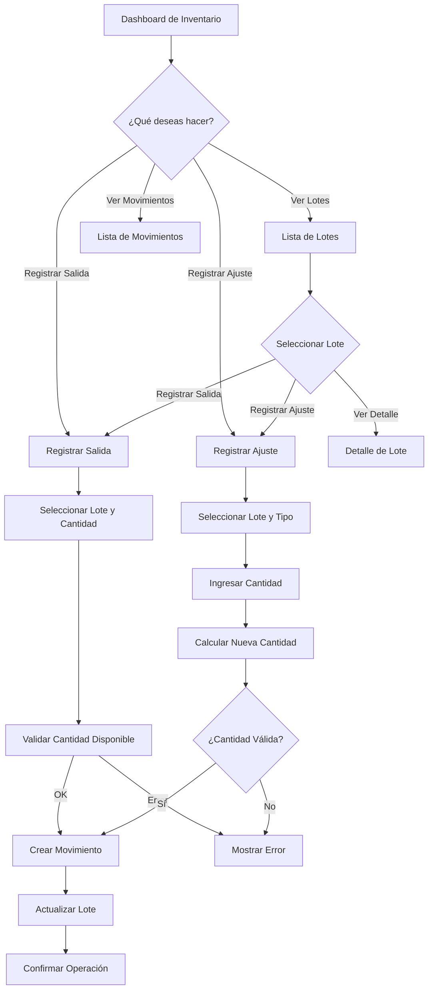
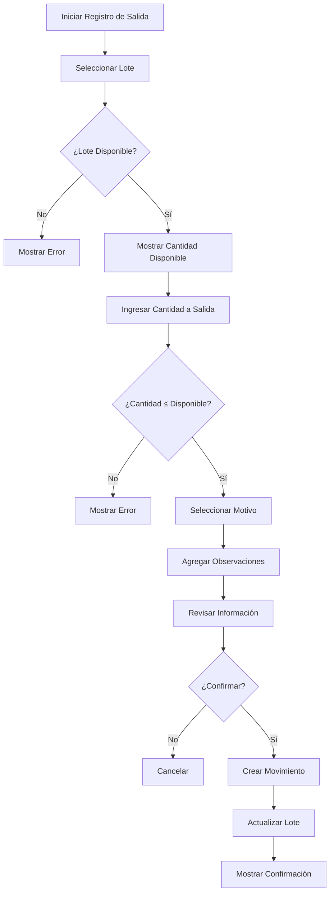
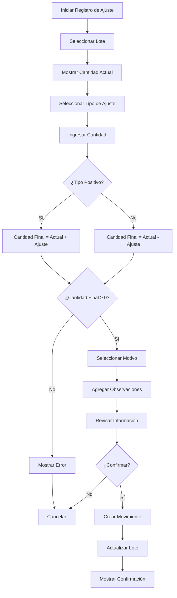

# Manual de Gestión de Inventario

**Versión:** 1.0  
**Fecha:** Diciembre 2025  
**Módulo:** Fase 2.3 - Gestión de Inventario

---

## Tabla de Contenidos

1. [Introducción](#introducción)
2. [Conceptos Clave](#conceptos-clave)
3. [Manual de Usuario](#manual-de-usuario)
4. [Documentación Técnica](#documentación-técnica)
5. [Diagramas de Flujo](#diagramas-de-flujo)
6. [Casos de Uso](#casos-de-uso)
7. [Preguntas Frecuentes](#preguntas-frecuentes)

---

## Introducción

El módulo de **Gestión de Inventario** permite a los usuarios gestionar y monitorear el inventario de medicamentos y suministros médicos en los almacenes del IMSS Bienestar. Este módulo proporciona herramientas para:

- 📊 Visualizar el estado actual del inventario
- 📦 Consultar lotes de productos
- 📤 Registrar salidas de inventario
- ⚙️ Realizar ajustes de cantidad
- 📈 Monitorear movimientos
- ⚠️ Alertas de caducidad

### Objetivos

- Mantener un registro preciso del inventario
- Facilitar el acceso a información de lotes
- Registrar movimientos de inventario
- Alertar sobre productos próximos a caducar
- Generar reportes de inventario

### Roles Involucrados

- **Almacenista:** Registra salidas y ajustes
- **Supervisor de Almacén:** Revisa movimientos y genera reportes
- **Administrador:** Configura alertas y parámetros

---

## Conceptos Clave

### Estados de un Lote

| Estado | Código | Descripción |
|--------|--------|-------------|
| **Disponible** | 1 | Lote disponible para uso |
| **Suspendido** | 4 | Lote suspendido temporalmente |
| **Deteriorado** | 5 | Lote con productos deteriorados |
| **Caducado** | 6 | Lote con productos caducados |

### Tipos de Movimiento

| Tipo | Descripción |
|------|-------------|
| **ENTRADA** | Entrada de productos al almacén |
| **SALIDA** | Salida de productos del almacén |
| **AJUSTE_POSITIVO** | Ajuste que aumenta la cantidad |
| **AJUSTE_NEGATIVO** | Ajuste que disminuye la cantidad |
| **TRANSFERENCIA_ENTRADA** | Recepción de transferencia |
| **TRANSFERENCIA_SALIDA** | Envío de transferencia |
| **CADUCIDAD** | Registro de caducidad |
| **DETERIORO** | Registro de deterioro |

### Información de Lote

Cada lote contiene:
- **Número de Lote:** Identificador único
- **Producto:** Descripción del medicamento/suministro
- **Cantidad Inicial:** Cantidad recibida
- **Cantidad Disponible:** Cantidad actual en stock
- **Almacén:** Ubicación física
- **Ubicación:** Posición específica en el almacén
- **Fecha de Caducidad:** Fecha de vencimiento
- **Precio Unitario:** Costo por unidad
- **Valor Total:** Costo total del lote

---

## Manual de Usuario

### 1. Acceder al Módulo de Gestión de Inventario

1. Inicia sesión en el sistema
2. En el menú principal, selecciona **Gestión de Inventario**
3. Verás el **Dashboard de Inventario** con un resumen general

### 2. Dashboard de Inventario

El dashboard muestra:

#### Panel de Resumen
- **Total de Lotes:** Cantidad total de lotes en el sistema
- **Productos Únicos:** Cantidad de productos diferentes
- **Almacenes:** Cantidad de almacenes
- **Valor Total:** Valor total del inventario

#### Alertas Importantes
- **Productos Próximos a Caducar:** Lotes con menos de 30 días
- **Productos Caducados:** Lotes que ya pasaron su fecha de vencimiento
- **Bajo Stock:** Productos con cantidad baja

#### Gráficos
- **Distribución por Almacén:** Gráfico de pastel con cantidad de lotes por almacén
- **Movimientos Recientes:** Gráfico de línea con movimientos del último mes
- **Top 10 Productos:** Productos con mayor cantidad en stock

#### Acciones Rápidas
- 🔍 Ver Lista de Lotes
- 📤 Registrar Salida
- ⚙️ Registrar Ajuste
- 📊 Ver Movimientos

### 3. Consultar Lista de Lotes

**Ruta:** Gestión de Inventario → Lista de Lotes

#### Filtros Disponibles

1. **Búsqueda:** Busca por número de lote o descripción de producto
2. **Estado:** Filtra por estado del lote (Disponible, Suspendido, Deteriorado, Caducado)
3. **Almacén:** Filtra por almacén específico
4. **Producto:** Filtra por producto específico

#### Información Mostrada

| Columna | Descripción |
|---------|-------------|
| **Lote** | Número de lote |
| **Producto** | Descripción del producto |
| **Almacén** | Nombre del almacén |
| **Ubicación** | Código de ubicación |
| **Cantidad** | Cantidad disponible (badge azul) |
| **Caducidad** | Fecha de vencimiento con código de color |
| **Estado** | Estado actual del lote |
| **Acciones** | Botones para ver detalle o registrar salida |

#### Códigos de Color para Caducidad

- 🟢 **Verde:** Más de 60 días para caducar
- 🟡 **Amarillo:** Entre 30 y 60 días para caducar
- 🔴 **Rojo:** Menos de 30 días o ya caducado

### 4. Ver Detalle de Lote

**Ruta:** Gestión de Inventario → Lista de Lotes → Detalle

Muestra información completa del lote:

#### Sección 1: Información General
- Número de lote
- Producto
- Almacén y ubicación
- Institución
- Estado actual

#### Sección 2: Información de Cantidad
- Cantidad inicial
- Cantidad disponible
- Cantidad utilizada

#### Sección 3: Información Financiera
- Precio unitario
- Valor total
- Fecha de recepción
- Número de remisión

#### Sección 4: Fechas Importantes
- Fecha de fabricación
- Fecha de caducidad
- Días para caducidad (con alerta si es necesario)

#### Sección 5: Movimientos
Tabla con todos los movimientos del lote:
- Fecha del movimiento
- Tipo de movimiento
- Cantidad anterior
- Cantidad nueva
- Motivo
- Usuario que registró

#### Acciones Disponibles
- 📤 **Registrar Salida:** Para sacar productos del almacén
- ⚙️ **Registrar Ajuste:** Para ajustar la cantidad
- 🚨 **Cambiar Estado:** Para cambiar el estado del lote

### 5. Registrar Salida de Inventario

**Ruta:** Gestión de Inventario → Registrar Salida

#### Paso 1: Seleccionar Lote

1. Haz clic en el campo **Lote**
2. Selecciona el lote del que deseas hacer salida
3. Se mostrarán automáticamente:
   - Cantidad disponible
   - Descripción del producto

#### Paso 2: Ingresar Cantidad

1. En el campo **Cantidad a Salida**, ingresa la cantidad que deseas sacar
2. El sistema validará que no exceda la cantidad disponible
3. Se mostrará en tiempo real:
   - Cantidad disponible
   - Cantidad a salida
   - Cantidad que quedaría

#### Paso 3: Seleccionar Motivo

Selecciona el motivo de la salida:
- **Distribución a Áreas:** Envío a diferentes áreas del hospital
- **Consumo:** Uso en servicios médicos
- **Devolución a Proveedor:** Devolución al proveedor
- **Pérdida:** Pérdida accidental
- **Robo:** Robo o hurto
- **Otro:** Otro motivo

#### Paso 4: Agregar Observaciones (Opcional)

Puedes agregar observaciones adicionales sobre la salida.

#### Paso 5: Guardar

1. Revisa que toda la información sea correcta
2. Haz clic en **Registrar Salida**
3. El sistema confirmará la operación
4. Se creará un registro de movimiento

### 6. Registrar Ajuste de Inventario

**Ruta:** Gestión de Inventario → Registrar Ajuste

Los ajustes se utilizan para corregir discrepancias entre el inventario físico y el sistema.

#### Paso 1: Seleccionar Lote

1. Selecciona el lote a ajustar
2. Se mostrará la cantidad actual

#### Paso 2: Seleccionar Tipo de Ajuste

Elige entre:
- **➕ Ajuste Positivo:** Aumentar la cantidad (ej: se encontraron productos)
- **➖ Ajuste Negativo:** Disminuir la cantidad (ej: se encontró faltante)

#### Paso 3: Ingresar Cantidad

Ingresa la cantidad a ajustar. El sistema calculará automáticamente la cantidad final.

#### Paso 4: Seleccionar Motivo

Selecciona el motivo del ajuste:
- **Conteo Físico:** Resultado de conteo físico
- **Corrección de Error:** Corrección de error en el sistema
- **Reposición:** Reposición de stock
- **Pérdida Encontrada:** Productos encontrados
- **Dañado:** Productos dañados
- **Otro:** Otro motivo

#### Paso 5: Agregar Observaciones

Describe el motivo del ajuste en detalle.

#### Paso 6: Guardar

Revisa la información y haz clic en **Registrar Ajuste**.

### 7. Ver Movimientos de Inventario

**Ruta:** Gestión de Inventario → Movimientos

Muestra el historial de todos los movimientos de inventario.

#### Filtros Disponibles

1. **Búsqueda:** Por número de lote o producto
2. **Tipo de Movimiento:** Filtra por tipo (Entrada, Salida, Ajuste, etc.)
3. **Desde:** Fecha inicial del rango
4. **Hasta:** Fecha final del rango

#### Información Mostrada

| Columna | Descripción |
|---------|-------------|
| **Fecha** | Fecha y hora del movimiento |
| **Tipo** | Tipo de movimiento (con badge de color) |
| **Lote** | Número de lote (enlace al detalle) |
| **Producto** | Descripción del producto |
| **Cantidad Anterior** | Cantidad antes del movimiento |
| **Cantidad Nueva** | Cantidad después del movimiento |
| **Cambio** | Diferencia (con badge verde/rojo) |
| **Motivo** | Motivo del movimiento |
| **Usuario** | Usuario que registró el movimiento |

---

## Documentación Técnica

### Arquitectura de Componentes

```
┌─────────────────────────────────────────────────────────┐
│                    Capa de Presentación                 │
│  (Templates HTML con Bootstrap y JavaScript)            │
└─────────────────────────────────────────────────────────┘
                            ↓
┌─────────────────────────────────────────────────────────┐
│                    Capa de Vistas                        │
│  (views_inventario.py - Django Class-Based Views)       │
└─────────────────────────────────────────────────────────┘
                            ↓
┌─────────────────────────────────────────────────────────┐
│                    Capa de Lógica                        │
│  (Formularios, Validaciones, Cálculos)                  │
└─────────────────────────────────────────────────────────┘
                            ↓
┌─────────────────────────────────────────────────────────┐
│                    Capa de Datos                         │
│  (Modelos: Lote, MovimientoInventario, Producto)        │
└─────────────────────────────────────────────────────────┘
```

### Modelos de Datos

#### Modelo: Lote

```python
class Lote(models.Model):
    numero_lote = CharField(max_length=50, unique=True)
    producto = ForeignKey(Producto, on_delete=CASCADE)
    almacen = ForeignKey(Almacen, on_delete=CASCADE)
    ubicacion = ForeignKey(UbicacionAlmacen, on_delete=SET_NULL)
    institucion = ForeignKey(Institucion, on_delete=CASCADE)
    
    cantidad_inicial = PositiveIntegerField()
    cantidad_disponible = PositiveIntegerField()
    
    precio_unitario = DecimalField(max_digits=10, decimal_places=2)
    valor_total = DecimalField(max_digits=15, decimal_places=2)
    
    fecha_fabricacion = DateField(null=True, blank=True)
    fecha_caducidad = DateField()
    fecha_recepcion = DateField()
    
    estado = IntegerField(choices=ESTADOS_LOTE)  # 1=Disponible, 4=Suspendido, 5=Deteriorado, 6=Caducado
    remision = CharField(max_length=50, null=True, blank=True)
    
    fecha_creacion = DateTimeField(auto_now_add=True)
    fecha_actualizacion = DateTimeField(auto_now=True)
```

#### Modelo: MovimientoInventario

```python
class MovimientoInventario(models.Model):
    TIPOS_MOVIMIENTO = [
        ('ENTRADA', 'Entrada'),
        ('SALIDA', 'Salida'),
        ('AJUSTE_POSITIVO', 'Ajuste Positivo'),
        ('AJUSTE_NEGATIVO', 'Ajuste Negativo'),
        ('TRANSFERENCIA_ENTRADA', 'Transferencia Entrada'),
        ('TRANSFERENCIA_SALIDA', 'Transferencia Salida'),
        ('CADUCIDAD', 'Caducidad'),
        ('DETERIORO', 'Deterioro'),
    ]
    
    lote = ForeignKey(Lote, on_delete=CASCADE)
    tipo_movimiento = CharField(max_length=30, choices=TIPOS_MOVIMIENTO)
    
    cantidad_anterior = PositiveIntegerField()
    cantidad_nueva = PositiveIntegerField()
    
    motivo = CharField(max_length=255)
    observaciones = TextField(null=True, blank=True)
    
    usuario = ForeignKey(User, on_delete=SET_NULL, null=True)
    
    fecha_creacion = DateTimeField(auto_now_add=True)
```

### Vistas (Views)

#### DashboardInventarioView

```python
class DashboardInventarioView(LoginRequiredMixin, TemplateView):
    """
    Dashboard principal de gestión de inventario
    Muestra resumen, alertas y gráficos
    """
    template_name = 'inventario/dashboard_inventario.html'
    
    def get_context_data(self, **kwargs):
        context = super().get_context_data(**kwargs)
        # Calcula estadísticas
        # Obtiene alertas
        # Prepara datos para gráficos
        return context
```

#### ListaLotesView

```python
class ListaLotesView(LoginRequiredMixin, ListView):
    """
    Lista de lotes con filtros
    Permite búsqueda por estado, almacén, producto
    """
    model = Lote
    template_name = 'inventario/lista_lotes.html'
    paginate_by = 50
    
    def get_queryset(self):
        # Aplica filtros
        # Ordena por fecha
        return queryset
```

#### DetalleLoteView

```python
class DetalleLoteView(LoginRequiredMixin, DetailView):
    """
    Detalle completo de un lote
    Muestra información y movimientos
    """
    model = Lote
    template_name = 'inventario/detalle_lote.html'
    
    def get_context_data(self, **kwargs):
        context = super().get_context_data(**kwargs)
        # Obtiene movimientos del lote
        # Calcula días para caducidad
        return context
```

#### RegistrarSalidaView

```python
class RegistrarSalidaView(LoginRequiredMixin, CreateView):
    """
    Registra salida de inventario
    Valida cantidad disponible
    Crea movimiento de inventario
    """
    form_class = RegistrarSalidaForm
    template_name = 'inventario/registrar_salida.html'
    
    def form_valid(self, form):
        # Valida cantidad
        # Actualiza lote
        # Crea movimiento
        return super().form_valid(form)
```

#### RegistrarAjusteView

```python
class RegistrarAjusteView(LoginRequiredMixin, CreateView):
    """
    Registra ajuste de inventario
    Puede ser positivo o negativo
    """
    form_class = RegistrarAjusteForm
    template_name = 'inventario/registrar_ajuste.html'
    
    def form_valid(self, form):
        # Calcula nueva cantidad
        # Actualiza lote
        # Crea movimiento
        return super().form_valid(form)
```

#### ListaMovimientosView

```python
class ListaMovimientosView(LoginRequiredMixin, ListView):
    """
    Lista de movimientos con filtros
    Permite filtrar por tipo, fecha, lote
    """
    model = MovimientoInventario
    template_name = 'inventario/lista_movimientos.html'
    paginate_by = 100
```

### Formularios

#### RegistrarSalidaForm

```python
class RegistrarSalidaForm(forms.Form):
    lote_id = forms.ModelChoiceField(
        queryset=Lote.objects.filter(estado=1),
        label="Lote"
    )
    cantidad_salida = forms.IntegerField(
        min_value=1,
        label="Cantidad a Salida"
    )
    motivo_salida = forms.ChoiceField(
        choices=[
            ('DISTRIBUCIÓN', 'Distribución a Áreas'),
            ('CONSUMO', 'Consumo'),
            ('DEVOLUCIÓN', 'Devolución a Proveedor'),
            ('PÉRDIDA', 'Pérdida'),
            ('ROBO', 'Robo'),
            ('OTRO', 'Otro'),
        ],
        label="Motivo de Salida"
    )
    observaciones = forms.CharField(
        widget=forms.Textarea,
        required=False,
        label="Observaciones"
    )
```

#### RegistrarAjusteForm

```python
class RegistrarAjusteForm(forms.Form):
    lote_id = forms.ModelChoiceField(
        queryset=Lote.objects.all(),
        label="Lote"
    )
    tipo_ajuste = forms.ChoiceField(
        choices=[
            ('AJUSTE_POSITIVO', 'Ajuste Positivo (Sumar)'),
            ('AJUSTE_NEGATIVO', 'Ajuste Negativo (Restar)'),
        ],
        label="Tipo de Ajuste"
    )
    cantidad = forms.IntegerField(
        min_value=1,
        label="Cantidad a Ajustar"
    )
    motivo = forms.ChoiceField(
        choices=[
            ('CONTEO_FÍSICO', 'Conteo Físico'),
            ('CORRECCIÓN_ERROR', 'Corrección de Error'),
            ('REPOSICIÓN', 'Reposición'),
            ('PÉRDIDA_ENCONTRADA', 'Pérdida Encontrada'),
            ('DAÑADO', 'Producto Dañado'),
            ('OTRO', 'Otro'),
        ],
        label="Motivo del Ajuste"
    )
    observaciones = forms.CharField(
        widget=forms.Textarea,
        required=False,
        label="Observaciones"
    )
```

### URLs

```python
# urls_inventario.py
from django.urls import path
from . import views_inventario

urlpatterns = [
    # Dashboard
    path('', views_inventario.DashboardInventarioView.as_view(), name='dashboard_inventario'),
    
    # Lotes
    path('lotes/', views_inventario.ListaLotesView.as_view(), name='lista_lotes'),
    path('lotes/<int:pk>/', views_inventario.DetalleLoteView.as_view(), name='detalle_lote'),
    path('lotes/<int:pk>/cambiar-estado/', views_inventario.CambiarEstadoLoteView.as_view(), name='cambiar_estado_lote'),
    
    # Movimientos
    path('salida/', views_inventario.RegistrarSalidaView.as_view(), name='registrar_salida'),
    path('ajuste/', views_inventario.RegistrarAjusteView.as_view(), name='registrar_ajuste'),
    path('movimientos/', views_inventario.ListaMovimientosView.as_view(), name='lista_movimientos'),
]
```

---

## Diagramas de Flujo

### Flujo General de Gestión de Inventario



### Flujo de Registro de Salida



### Flujo de Registro de Ajuste



---

## Casos de Uso

### Caso 1: Consultar Stock de un Producto

**Objetivo:** Verificar la cantidad disponible de un producto específico

**Pasos:**
1. Accede a Gestión de Inventario → Lista de Lotes
2. En el campo "Producto", selecciona el producto deseado
3. Haz clic en "Filtrar"
4. Verás todos los lotes del producto con sus cantidades
5. Haz clic en un lote para ver el detalle completo

**Resultado:** Conoces la cantidad total disponible y la ubicación de cada lote

---

### Caso 2: Registrar Salida para Distribución

**Objetivo:** Registrar la salida de medicamentos para distribución a áreas

**Pasos:**
1. Accede a Gestión de Inventario → Registrar Salida
2. Selecciona el lote del medicamento
3. Ingresa la cantidad a distribuir
4. Selecciona "Distribución a Áreas" como motivo
5. Agrega observaciones (ej: Área de Urgencias, Piso 3)
6. Haz clic en "Registrar Salida"

**Resultado:** La cantidad se resta del lote y se crea un registro de movimiento

---

### Caso 3: Corregir Discrepancia de Inventario

**Objetivo:** Corregir una diferencia encontrada en el conteo físico

**Pasos:**
1. Se realiza conteo físico y se encuentra una diferencia
2. Accede a Gestión de Inventario → Registrar Ajuste
3. Selecciona el lote
4. Si hay faltante: Selecciona "Ajuste Negativo" e ingresa la cantidad faltante
5. Si hay exceso: Selecciona "Ajuste Positivo" e ingresa la cantidad encontrada
6. Selecciona "Conteo Físico" como motivo
7. Agrega observaciones con detalles del conteo
8. Haz clic en "Registrar Ajuste"

**Resultado:** El inventario se ajusta a la realidad física

---

### Caso 4: Monitorear Productos Próximos a Caducar

**Objetivo:** Identificar productos que pronto caducarán

**Pasos:**
1. Accede a Gestión de Inventario → Dashboard
2. En la sección "Alertas Importantes", verás "Productos Próximos a Caducar"
3. Haz clic en "Ver Todos" para ver la lista completa
4. Puedes filtrar por almacén o producto
5. Prioriza el uso de estos productos

**Resultado:** Evitas pérdidas por caducidad

---

### Caso 5: Generar Reporte de Movimientos

**Objetivo:** Obtener un reporte de todos los movimientos de un período

**Pasos:**
1. Accede a Gestión de Inventario → Movimientos
2. Ingresa la fecha inicial y final
3. Opcionalmente, filtra por tipo de movimiento
4. Haz clic en "Filtrar"
5. Verás todos los movimientos del período
6. Puedes exportar a Excel si lo deseas

**Resultado:** Tienes un registro completo de todas las transacciones

---

## Preguntas Frecuentes

### ¿Qué pasa si intento registrar una salida mayor a la cantidad disponible?

El sistema validará la cantidad y mostrará un error indicando que no hay suficiente cantidad disponible. Deberás reducir la cantidad de salida.

---

### ¿Puedo deshacer un movimiento registrado?

Sí, puedes anular un movimiento desde la lista de movimientos. Esto revertirá el cambio en el inventario y creará un nuevo movimiento de anulación.

---

### ¿Cómo sé cuándo un producto está próximo a caducar?

El sistema muestra alertas en el dashboard. Los productos con menos de 30 días para caducar aparecen en la sección de alertas. Además, en la lista de lotes, los productos próximos a caducar se muestran con un badge amarillo.

---

### ¿Qué información se guarda en un movimiento?

Se guarda:
- Tipo de movimiento
- Cantidad anterior y nueva
- Motivo
- Observaciones
- Usuario que lo registró
- Fecha y hora

---

### ¿Puedo cambiar el estado de un lote?

Sí, desde el detalle del lote, puedes cambiar el estado a Suspendido, Deteriorado o Caducado. Esto es útil cuando encuentras productos dañados o caducados.

---

### ¿Cómo se calcula el valor total del inventario?

El valor total se calcula multiplicando el precio unitario por la cantidad disponible de cada lote. El dashboard suma todos estos valores.

---

### ¿Qué tipos de ajustes puedo registrar?

Puedes registrar ajustes positivos (aumentar cantidad) o negativos (disminuir cantidad). Los motivos incluyen conteo físico, corrección de errores, reposición, pérdidas encontradas, productos dañados, etc.

---

### ¿Puedo filtrar movimientos por usuario?

Actualmente no, pero puedes filtrar por tipo de movimiento, fecha y lote. Si necesitas reportes por usuario, contacta al administrador.

---

### ¿Qué pasa si un lote se agota?

Cuando la cantidad disponible llega a cero, el lote sigue en el sistema pero no aparece en los selectores de salida. Puedes cambiar su estado a "Suspendido" o "Caducado" según corresponda.

---

### ¿Cómo exporto un reporte de inventario?

En la lista de lotes o movimientos, hay un botón "Exportar a Excel" que descarga un archivo con los datos filtrados.

---

### ¿Puedo registrar salidas para múltiples lotes a la vez?

Actualmente, debes registrar cada salida por separado. Si necesitas una función de salida masiva, contacta al administrador.

---

### ¿Qué información se muestra en el detalle de un lote?

Se muestra:
- Información general (número, producto, almacén, ubicación)
- Cantidades (inicial, disponible, utilizada)
- Información financiera (precio, valor total)
- Fechas importantes (fabricación, caducidad, recepción)
- Historial de movimientos

---

## Resumen y Checklist

### Antes de Registrar una Salida

- ✅ Verifica que el lote esté disponible
- ✅ Confirma la cantidad disponible
- ✅ Asegúrate de que la cantidad a salida no exceda la disponible
- ✅ Selecciona el motivo correcto
- ✅ Agrega observaciones si es necesario

### Antes de Registrar un Ajuste

- ✅ Realiza conteo físico
- ✅ Compara con el sistema
- ✅ Identifica la diferencia
- ✅ Selecciona el tipo de ajuste (positivo/negativo)
- ✅ Documenta el motivo

### Monitoreo Regular

- ✅ Revisa el dashboard diariamente
- ✅ Atiende las alertas de caducidad
- ✅ Realiza conteos físicos periódicamente
- ✅ Genera reportes mensuales
- ✅ Mantén el inventario actualizado

---

## Soporte y Contacto

Para reportar problemas o sugerencias:
- 📧 Email: soporte@imssbienestar.gob.mx
- 📞 Teléfono: +52 (55) XXXX-XXXX
- 🕐 Horario: Lunes a Viernes, 8:00 AM - 5:00 PM

---

**Última actualización:** Diciembre 2025  
**Versión:** 1.0  
**Estado:** Vigente
