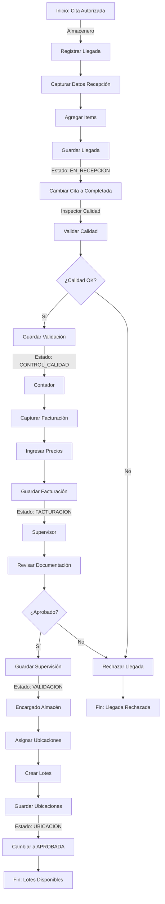
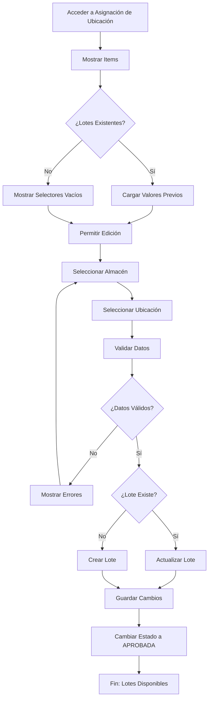
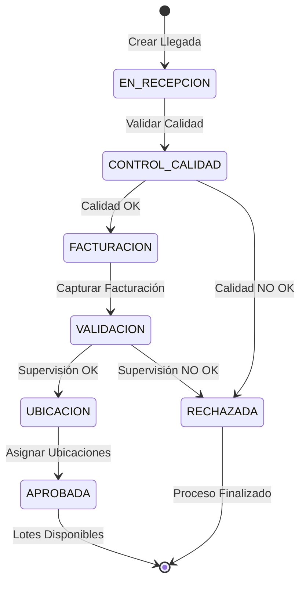

# Manual: Fase 2.2.2 - Llegada de Proveedores

**Versión:** 1.0  
**Fecha:** Diciembre 2025  
**Estado:** Completado

---

## Tabla de Contenidos

1. [Introducción](#introducción)
2. [Manual de Usuario](#manual-de-usuario)
3. [Documentación Técnica](#documentación-técnica)
4. [Diagramas de Flujo](#diagramas-de-flujo)
5. [Casos de Uso](#casos-de-uso)
6. [Preguntas Frecuentes](#preguntas-frecuentes)

---

## Introducción

### Descripción General

La **Fase 2.2.2: Llegada de Proveedores** es el módulo encargado de registrar y gestionar la recepción física de mercancía proveniente de los proveedores. Este módulo es fundamental en el flujo de logística del sistema de inventario hospitalario.

### Objetivos

- Registrar la llegada física de proveedores
- Capturar datos de recepción inicial
- Validar control de calidad
- Procesar información de facturación
- Realizar supervisión de la llegada
- Asignar ubicaciones en almacén
- Generar lotes de inventario

### Roles Involucrados

| Rol | Responsabilidad |
|-----|-----------------|
| **Almacenero** | Registra la llegada y captura datos iniciales |
| **Inspector de Calidad** | Valida la calidad de los productos |
| **Contador/Facturador** | Captura datos de facturación |
| **Supervisor** | Realiza validación final |
| **Encargado de Almacén** | Asigna ubicaciones físicas |

---

## Manual de Usuario

### 1. Acceso al Módulo

#### Paso 1: Navegar al Módulo
1. Inicia sesión en el sistema
2. Dirígete a **Logística** → **Llegada de Proveedores**
3. Verás la lista de llegadas registradas

#### Paso 2: Interfaz Principal

La interfaz muestra:
- **Resumen de estados** (tarjetas con conteos)
- **Tabla de llegadas** con columnas:
  - Folio
  - Proveedor
  - Fecha Llegada
  - Estado
  - Acciones

### 2. Registrar Nueva Llegada

#### Paso 1: Iniciar Registro
1. Haz clic en el botón **"+ Registrar Nueva Llegada"** (color morado)
2. Se abrirá el formulario de creación

#### Paso 2: Seleccionar Cita Autorizada

```
Campo: Cita Autorizada
- Haz clic en el dropdown
- Selecciona una cita con estado "Autorizada"
- Solo aparecen citas que no tienen llegada registrada
```

**Nota:** La cita debe haber sido creada previamente en el módulo de Citas de Proveedores.

#### Paso 3: Capturar Datos de Recepción

Completa los siguientes campos:

| Campo | Descripción | Tipo | Obligatorio |
|-------|-------------|------|-------------|
| **Remisión** | Número de remisión del proveedor | Texto | Sí |
| **Piezas Emitidas** | Cantidad de piezas que emitió el proveedor | Número | Sí |
| **Piezas Recibidas** | Cantidad de piezas efectivamente recibidas | Número | Sí |
| **Observaciones** | Notas sobre la recepción | Texto largo | No |

**Ejemplo:**
```
Remisión: REM-2025-001234
Piezas Emitidas: 50
Piezas Recibidas: 50
Observaciones: Mercancía en buen estado, sin daños aparentes
```

#### Paso 4: Agregar Items

1. En la sección **"Items de la Llegada"**, haz clic en **"+ Agregar Item"**
2. Completa los datos para cada producto:

| Campo | Descripción | Tipo |
|-------|-------------|------|
| **Producto** | Selecciona de la lista | Dropdown |
| **Número de Lote** | Identificador del lote | Texto |
| **Fecha de Caducidad** | Fecha de vencimiento | Fecha |
| **Cantidad Emitida** | Cantidad que emitió el proveedor | Número |
| **Cantidad Recibida** | Cantidad efectivamente recibida | Número |
| **Marca** | Marca del producto | Texto |
| **Fabricante** | Fabricante del producto | Texto |
| **Fecha de Elaboración** | Fecha de manufactura | Fecha |

**Ejemplo:**
```
Producto: ABATACEPT. SOLUCIÓN INYECTABLE
Número de Lote: 123456
Fecha de Caducidad: 19/12/2029
Cantidad Emitida: 30
Cantidad Recibida: 30
Marca: BRISTOL-MYERS SQUIBB
Fabricante: BRISTOL-MYERS SQUIBB
Fecha de Elaboración: 19/12/2022
```

#### Paso 5: Guardar Llegada

1. Revisa que todos los datos sean correctos
2. Haz clic en **"Guardar Llegada"**
3. El sistema asignará automáticamente un **folio** (LLEG-YYYYMMDDHHMMSS)
4. Se cambiará el estado de la cita a **"Completada"**

**Estado después de guardar:** EN_RECEPCION

---

### 3. Control de Calidad

#### Paso 1: Acceder a Control de Calidad

1. Desde el detalle de la llegada, haz clic en **"Validar Calidad"**
2. Se abrirá el formulario de validación

#### Paso 2: Completar Validación

| Campo | Descripción |
|-------|-------------|
| **Estado de Calidad** | Aprobado / Rechazado / Parcial |
| **Observaciones** | Detalles de la validación |
| **Firma Digital** | Se captura automáticamente |

**Ejemplo:**
```
Estado: Aprobado
Observaciones: Todos los productos cumplen con los estándares de calidad.
Temperatura de almacenamiento: Correcta
Empaque: Íntegro
```

#### Paso 3: Guardar Validación

1. Haz clic en **"Guardar Validación"**
2. El estado cambiará a **CONTROL_CALIDAD**

---

### 4. Capturación de Facturación

#### Paso 1: Acceder a Facturación

1. Desde el detalle de la llegada, haz clic en **"Capturar Facturación"**
2. Se abrirá el formulario de facturación

#### Paso 2: Datos de Facturación

| Campo | Descripción | Obligatorio |
|-------|-------------|-------------|
| **Número de Factura** | Número de factura del proveedor | Sí |
| **Número de Orden de Suministro** | Orden de compra | Sí |
| **Número de Contrato** | Contrato asociado | Sí |
| **Número de Procedimiento** | Procedimiento de compra | No |
| **Programa Presupuestario** | Programa presupuestario | No |
| **Tipo de Compra** | Tipo de compra | No |

#### Paso 3: Precios por Item

Para cada item, captura:

| Campo | Descripción |
|-------|-------------|
| **Precio Unitario sin IVA** | Precio por unidad |
| **Porcentaje IVA** | Porcentaje de IVA aplicable |

**Ejemplo:**
```
Número de Factura: FAC-2025-001234
Número de Orden: OS-2025-5678
Número de Contrato: CON-2025-9012
Tipo de Compra: Compra Directa

Item 1:
- Precio Unitario: $1,250.00
- IVA: 16%
```

#### Paso 4: Guardar Facturación

1. Revisa los datos
2. Haz clic en **"Guardar Facturación"**
3. El estado cambiará a **FACTURACION**

---

### 5. Supervisión

#### Paso 1: Acceder a Supervisión

1. Desde el detalle de la llegada, haz clic en **"Supervisar"**
2. Se abrirá el formulario de supervisión

#### Paso 2: Validación de Supervisión

| Campo | Descripción |
|-------|-------------|
| **Estado de Supervisión** | Aprobado / Rechazado |
| **Observaciones** | Comentarios del supervisor |
| **Firma Digital** | Se captura automáticamente |

**Ejemplo:**
```
Estado: Aprobado
Observaciones: Llegada completamente verificada. Todos los documentos en orden.
Documentación: Completa
Trazabilidad: Confirmada
```

#### Paso 3: Guardar Supervisión

1. Haz clic en **"Guardar Supervisión"**
2. El estado cambiará a **VALIDACION**

---

### 6. Asignación de Ubicación

#### Paso 1: Acceder a Asignación de Ubicación

1. Desde el detalle de la llegada, haz clic en **"Asignar Ubicación"**
2. Se abrirá el formulario de ubicación

#### Paso 2: Asignar Ubicación a Cada Item

Para cada item recibido, debes asignar:

| Campo | Descripción |
|-------|-------------|
| **Almacén** | Almacén donde se guardará el producto |
| **Ubicación** | Ubicación específica dentro del almacén |

**Ejemplo:**
```
Item 1: ABATACEPT
- Almacén: Almacén ALMACÉN CENTRAL
- Ubicación: A.01.1.0 - Almacén ALMACÉN CENTRAL

Item 2: ABATELENGUAS
- Almacén: Almacén ALMACÉN CENTRAL
- Ubicación: A.01.1.0 - Almacén ALMACÉN CENTRAL
```

#### Paso 3: Editar Ubicaciones

Si necesitas cambiar una ubicación:
1. Vuelve a acceder a **"Asignar Ubicación"**
2. Los selectores mostrarán la selección anterior
3. Cambia los valores según sea necesario
4. Haz clic en **"Guardar Ubicaciones"**

#### Paso 4: Guardar Ubicaciones

1. Revisa que todas las ubicaciones sean correctas
2. Haz clic en **"Guardar Ubicaciones"**
3. El estado cambiará a **UBICACION**
4. Se crearán automáticamente los **lotes** en el inventario

**Resultado:**
- Se generan lotes con estado "Disponible"
- Se vinculan a los almacenes y ubicaciones asignadas
- Los productos están listos para ser consultados en inventario

---

### 7. Visualizar Detalle de Llegada

#### Información General

En el detalle se muestra:
- **Proveedor:** Razón social del proveedor
- **Fecha Llegada:** Fecha y hora de recepción
- **Estado:** Estado actual de la llegada

#### Items Recibidos

Tabla con:
- **Producto:** Descripción del producto
- **Lote:** Número de lote
- **Caducidad:** Fecha de vencimiento
- **Cantidad Recibida:** Unidades recibidas
- **Almacén:** Almacén asignado
- **Ubicación:** Ubicación específica

---

## Documentación Técnica

### Arquitectura

#### Componentes Principales

```
LlegadaProveedor (Modelo Principal)
├── CitaProveedor (Relación OneToOne)
├── Proveedor (Relación ForeignKey)
├── ItemLlegada (Relación OneToMany)
└── DocumentoLlegada (Relación OneToMany)
```

### Modelos de Datos

#### LlegadaProveedor

```python
class LlegadaProveedor(models.Model):
    # Identificadores
    id = UUIDField(primary_key=True)
    folio = CharField(max_length=50, unique=True)
    
    # Relaciones
    cita = OneToOneField(CitaProveedor)
    proveedor = ForeignKey(Proveedor)
    
    # Datos de Recepción
    fecha_llegada_real = DateTimeField()
    remision = CharField(max_length=100)
    numero_piezas_emitidas = IntegerField()
    numero_piezas_recibidas = IntegerField()
    observaciones_recepcion = TextField()
    
    # Control de Calidad
    estado_calidad = CharField(choices=[...])
    observaciones_calidad = TextField()
    firma_calidad = TextField()
    usuario_calidad = ForeignKey(User)
    fecha_calidad = DateTimeField()
    
    # Facturación
    numero_factura = CharField(max_length=100)
    numero_orden_suministro = CharField(max_length=100)
    numero_contrato = CharField(max_length=100)
    numero_procedimiento = CharField(max_length=100)
    programa_presupuestario = CharField(max_length=100)
    tipo_compra = CharField(max_length=100)
    
    # Supervisión
    estado_supervision = CharField(choices=[...])
    observaciones_supervision = TextField()
    firma_supervision = TextField()
    usuario_supervision = ForeignKey(User)
    fecha_supervision = DateTimeField()
    
    # Ubicación
    usuario_ubicacion = ForeignKey(User)
    fecha_ubicacion = DateTimeField()
    
    # Estado General
    estado = CharField(choices=[
        'EN_RECEPCION',
        'CONTROL_CALIDAD',
        'FACTURACION',
        'VALIDACION',
        'UBICACION',
        'APROBADA',
        'RECHAZADA'
    ])
    
    # Auditoría
    creado_por = ForeignKey(User)
    fecha_creacion = DateTimeField(auto_now_add=True)
    fecha_actualizacion = DateTimeField(auto_now=True)
```

#### ItemLlegada

```python
class ItemLlegada(models.Model):
    # Relaciones
    llegada = ForeignKey(LlegadaProveedor)
    producto = ForeignKey(Producto)
    lote_creado = ForeignKey(Lote, null=True, blank=True)
    
    # Datos del Item
    numero_lote = CharField(max_length=100)
    fecha_caducidad = DateField()
    cantidad_emitida = IntegerField()
    cantidad_recibida = IntegerField()
    marca = CharField(max_length=100)
    fabricante = CharField(max_length=100)
    fecha_elaboracion = DateField()
    precio_unitario_sin_iva = DecimalField()
    porcentaje_iva = DecimalField()
```

### Vistas (Views)

#### ListaLlegadasView
- **Método:** GET
- **Propósito:** Mostrar lista de llegadas
- **Optimización:** `select_related('proveedor')`

#### CrearLlegadaView
- **Método:** GET, POST
- **Propósito:** Crear nueva llegada
- **Acciones:**
  - Asigna `proveedor_id` desde la cita
  - Genera folio automático
  - Cambia estado de cita a "completada"

#### DetalleLlegadaView
- **Método:** GET
- **Propósito:** Mostrar detalle de llegada
- **Optimización:** `select_related('proveedor')`

#### ControlCalidadView
- **Método:** GET, POST
- **Propósito:** Validar calidad

#### FacturacionView
- **Método:** GET, POST
- **Propósito:** Capturar datos de facturación

#### SupervisionView
- **Método:** GET, POST
- **Propósito:** Realizar supervisión

#### UbicacionView
- **Método:** GET, POST
- **Propósito:** Asignar ubicaciones y crear lotes
- **Acciones:**
  - Crea lotes en inventario
  - Actualiza o crea lotes existentes
  - Asigna almacén y ubicación

### Formularios

#### LlegadaProveedorForm
- **Campos:** cita, remision, numero_piezas_emitidas, numero_piezas_recibidas, observaciones_recepcion
- **Widget:** Select2 para cita

#### ItemLlegadaForm
- **Campos:** producto, numero_lote, fecha_caducidad, cantidad_emitida, cantidad_recibida, marca, fabricante, fecha_elaboracion
- **Widget:** Select2 para producto

#### UbicacionFormSet
- **Tipo:** BaseFormSet personalizado
- **Propósito:** Generar formularios dinámicamente por cada item
- **Campos:** almacen, ubicacion
- **Características:**
  - Carga valores previos si existen
  - Permite editar ubicaciones
  - Usa Select2 para ambos campos

### Flujo de Datos

```
1. Crear Llegada
   ├── Seleccionar Cita Autorizada
   ├── Capturar datos de recepción
   ├── Agregar items
   ├── Guardar (Estado: EN_RECEPCION)
   └── Cambiar cita a "Completada"

2. Control de Calidad
   ├── Validar productos
   ├── Capturar observaciones
   ├── Guardar (Estado: CONTROL_CALIDAD)
   └── Registrar usuario y firma

3. Facturación
   ├── Capturar datos de factura
   ├── Ingresar precios por item
   ├── Guardar (Estado: FACTURACION)
   └── Calcular totales

4. Supervisión
   ├── Revisar documentación
   ├── Validar cumplimiento
   ├── Guardar (Estado: VALIDACION)
   └── Registrar firma

5. Asignación de Ubicación
   ├── Asignar almacén a cada item
   ├── Asignar ubicación específica
   ├── Crear lotes en inventario
   ├── Guardar (Estado: UBICACION)
   └── Cambiar estado a APROBADA
```

### Base de Datos

#### Tablas Principales

| Tabla | Descripción |
|-------|-------------|
| `inventario_llegadaproveedor` | Registro de llegadas |
| `inventario_itemllegada` | Items de cada llegada |
| `inventario_citaproveedor` | Citas de proveedores |
| `inventario_proveedor` | Catálogo de proveedores |
| `inventario_lote` | Lotes creados en inventario |

#### Relaciones

```
LlegadaProveedor
├── 1:1 → CitaProveedor
├── N:1 → Proveedor
├── 1:N → ItemLlegada
└── 1:N → DocumentoLlegada

ItemLlegada
├── N:1 → LlegadaProveedor
├── N:1 → Producto
└── N:1 → Lote (creado_lote)
```

---

## Diagramas de Flujo

### Diagrama 1: Flujo General de Llegada de Proveedores



### Diagrama 2: Proceso de Asignación de Ubicación



### Diagrama 3: Ciclo de Vida de la Llegada



---

## Casos de Uso

### Caso 1: Recepción Completa y Exitosa

**Escenario:** Un proveedor entrega medicamentos que pasan todas las validaciones.

**Pasos:**

1. **Almacenero** registra la llegada:
   - Cita: "AMBIDERM - 28/12/2025 08:08"
   - Remisión: "REM-2025-001234"
   - Piezas: 30 emitidas, 30 recibidas
   - Agrega 1 item: ABATACEPT, Lote 123456

2. **Inspector de Calidad** valida:
   - Estado: Aprobado
   - Observaciones: "Todos los productos cumplen estándares"

3. **Contador** captura facturación:
   - Factura: "FAC-2025-001234"
   - Precio unitario: $1,250.00
   - IVA: 16%

4. **Supervisor** revisa:
   - Estado: Aprobado
   - Observaciones: "Documentación completa"

5. **Encargado de Almacén** asigna ubicación:
   - Almacén: "Almacén ALMACÉN CENTRAL"
   - Ubicación: "A.01.1.0"

**Resultado:** Llegada APROBADA, Lote creado y disponible en inventario.

---

### Caso 2: Recepción con Discrepancia

**Escenario:** Se reciben menos unidades de las emitidas.

**Pasos:**

1. **Almacenero** registra:
   - Piezas emitidas: 50
   - Piezas recibidas: 45
   - Observaciones: "Faltaron 5 unidades"

2. **Inspector de Calidad** valida:
   - Estado: Parcial
   - Observaciones: "Faltantes reportados"

3. **Contador** captura:
   - Ajusta cantidad a 45 unidades
   - Recalcula totales

4. **Supervisor** revisa:
   - Verifica documentación
   - Aprueba con observación

5. **Encargado de Almacén**:
   - Asigna ubicación
   - Se crea lote con 45 unidades

**Resultado:** Llegada APROBADA con discrepancia registrada.

---

### Caso 3: Recepción Rechazada

**Escenario:** Los productos no cumplen con estándares de calidad.

**Pasos:**

1. **Almacenero** registra llegada

2. **Inspector de Calidad** valida:
   - Estado: Rechazado
   - Observaciones: "Productos dañados, empaque comprometido"

**Resultado:** Llegada RECHAZADA, proceso finalizado. No se crean lotes.

---

## Preguntas Frecuentes

### ¿Qué sucede si rechazo una llegada?

El proceso se detiene y la llegada queda con estado "RECHAZADA". No se crean lotes en inventario. Puedes crear una nueva llegada para la misma cita.

### ¿Puedo editar una llegada después de guardarla?

Sí, puedes editar la ubicación accediendo nuevamente a "Asignar Ubicación". Los selectores mostrarán la selección anterior.

### ¿Qué sucede con la cita después de registrar una llegada?

El estado de la cita cambia automáticamente de "Autorizada" a "Completada".

### ¿Puedo agregar más items después de guardar la llegada?

No, los items se agregan solo durante la creación. Si necesitas agregar más, debes crear una nueva llegada.

### ¿Qué información se requiere para crear un lote?

Se requiere:
- Producto
- Número de lote
- Fecha de caducidad
- Cantidad
- Almacén
- Ubicación

### ¿Qué sucede si no asigno ubicación a un item?

El sistema no permite guardar sin asignar ubicación. Todos los items deben tener almacén y ubicación.

### ¿Puedo cambiar el almacén después de asignar ubicación?

Sí, accede nuevamente a "Asignar Ubicación" y cambia los valores. El lote se actualizará automáticamente.

### ¿Qué campos son obligatorios en cada fase?

**Recepción:** Remisión, Piezas Emitidas, Piezas Recibidas, Items  
**Calidad:** Estado de Calidad  
**Facturación:** Número de Factura, Orden de Suministro, Contrato, Precios  
**Supervisión:** Estado de Supervisión  
**Ubicación:** Almacén y Ubicación para cada item

### ¿Cómo se calcula el valor total de un lote?

Valor Total = Precio Unitario × Cantidad

### ¿Qué sucede si hay un error en los datos?

El sistema mostrará mensajes de error específicos. Corrige los datos y guarda nuevamente.

---

## Resumen de Estados

| Estado | Descripción | Acciones Disponibles |
|--------|-------------|---------------------|
| **EN_RECEPCION** | Llegada registrada | Validar Calidad |
| **CONTROL_CALIDAD** | Calidad validada | Capturar Facturación |
| **FACTURACION** | Datos de factura capturados | Supervisar |
| **VALIDACION** | Supervisión completada | Asignar Ubicación |
| **UBICACION** | Ubicaciones asignadas | (Ninguna) |
| **APROBADA** | Proceso completado | Ver Detalle |
| **RECHAZADA** | Llegada rechazada | Ver Detalle |

---

## Conclusión

El módulo de **Llegada de Proveedores** es fundamental para el control de inventario hospitalario. Proporciona un flujo estructurado que asegura:

- ✅ Recepción controlada de mercancía
- ✅ Validación de calidad
- ✅ Registro de datos financieros
- ✅ Supervisión de procesos
- ✅ Asignación correcta de ubicaciones
- ✅ Generación de lotes disponibles

El sistema está diseñado para ser intuitivo y eficiente, minimizando errores y asegurando trazabilidad completa.

---

**Documento generado:** Diciembre 2025  
**Versión:** 1.0  
**Estado:** Completado
